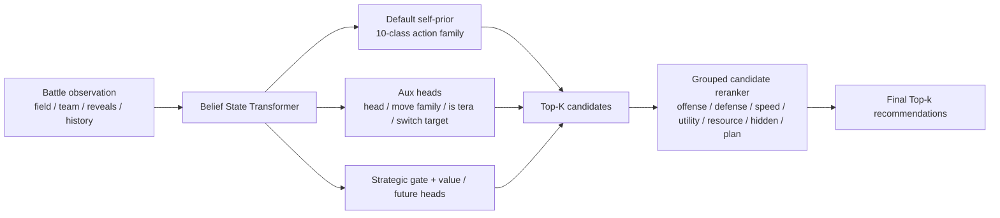
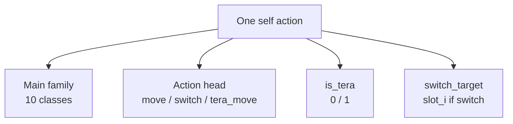

# pokestrategist

> 基于深度学习的 Pokémon Showdown 对局决策辅助系统

## 1. 项目概述

pokestrategist 是一个 **human-in-the-loop** 的 AI 辅助决策系统，面向 Pokémon Showdown 竞技对战场景。它不是自动代打 bot，而是一个实时分析与推荐工具，核心流程为：

1. 读取当前对局状态
2. 分析敌我双方已知信息
3. 预测对手下一步行为分布
4. 评估我方每个合法动作的期望收益
5. 输出动作推荐（Top-k）及推荐理由与置信度

## 2. 项目动机与创新点

### 2.1 现有工作分析

| 项目 | 定位 | 局限 |
|------|------|------|
| **Showdex** | 伤害计算 + 信息同步面板 | 无深度学习，无行为预测，无动作推荐 |
| **Pokemon Battle Predictor** | 对手行为预测（胜负预测、换人预测、招式预测） | 仅做对手建模，不做我方动作推荐 |
| **poke-env / 各类 RL bot** | 自动对战 agent | 目标是全自动打 ladder，非辅助决策 |

### 2.2 本项目创新点

- 在**对手行为预测**的基础上，进一步完成**我方动作推荐**
- 输出概率分布而非单一决策，保留人类玩家的最终决定权
- 提供可解释的推荐理由（关键因素归因）

## 3. 当前模型设计

pokestrategist 当前主线不是“先预测对手，再手工模拟整回合”，而是一个 **history-aware belief-state model + bounded reranker**。它回答的问题是：

> 历史分析 + 当下状态 + 未来短期后果，如何共同决定这一手动作排序。



### 3.1 主标签空间

- 主任务是 **我方动作 family 排序**，不是纯对手动作预测。
- 当前主分类空间固定为 10 类：
  - `move_attack`
  - `move_hazard`
  - `move_hazard_control`
  - `move_pivot`
  - `move_recovery`
  - `move_screen`
  - `move_setup`
  - `move_support`
  - `move_trick_room`
  - `switch`
- `tera_move_*` 不再单独占主类，而是折叠回对应的 `move_*` 主类；`action_head=tera_move` 和 `is_tera=1` 仍由辅助头显式建模。
- `switch target` 也不并入主类，而是作为单独辅助监督，避免主标签空间过粗或过碎。



### 3.2 Backbone 与重排器

- Backbone 是 **entity-centric Belief State Transformer**，读取双方队伍、场地、revealed moves、对手历史和隐藏信息先验摘要。
- Default branch 先输出一个 self action-family prior。
- Reranker 只对 Top-K 候选做重排，不直接搜索完整动作树。
- 候选证据按 7 组摘要组织：`offense`、`defense`、`speed`、`utility`、`resource`、`hidden`、`plan`。
- 共享辅助头同时建模：`action_head`、`move_family`、`is_tera`、`switch_target`、`strategic_gate`、`strategic_intent`、`value`、`future_value`。

### 3.3 当前推荐配置

| 组件 | 当前选择 |
|------|----------|
| 主标签空间 | 10 类 collapsed action family |
| Backbone | Hierarchical Belief State Transformer |
| Reranker | `grouped_action_value`, TopK = 8 |
| Future bundle | horizons = 2, 4 |
| Switch 辅助 | `hier-switch-target-weight = 0.1` |
| 选模指标 | `top3_accuracy` |

## 4. 技术路线

### 4.1 数据来源与样本

**数据源：** Pokémon Showdown 公开 replay / battle log

**数据流水线：**

```text
Raw Replay -> Replay Parser -> Structured Turn Samples -> Belief-state Dataset -> Training
```

**每条训练样本：**
- **输入：** 实体级当前局面、对手历史、模板后验摘要、场地与队伍结构特征
- **主标签：** 我方动作 family（10 类）
- **辅助标签：** `action_head`、`move_family`、`is_tera`、`switch_target`
- **未来标签：** `value_label`、`future_value_labels`、`strategic_intent_targets`、`strategic_gate_target`

### 4.2 训练目标与推理流程

1. Backbone 编码当前 belief state。
2. Default branch 产出动作 family 的默认排序。
3. Top-K 候选进入 grouped reranker，结合辅助头与未来摘要做重排。
4. 最终输出按概率排序的 Top-k 结果。
5. 评估时主要读取：整体与按类的 `top1` / `top2` / `top3`，以及 `gold_in_topk_rate`、`gold_top1_rate` 等内部诊断。

### 4.3 当前推荐工作流

- 训练入口使用 `train_action_family`。
- 评估入口使用 `evaluate_action_family`。
- 对启用 reranker 的 self 模型，优先用 `top3_accuracy` 选模。
- 分析结果时，不只看 overall top-k，也要同时看 `switch`、`move_pivot`、`move_recovery`、`move_support` 这些关键类别的按类 top-k。
- 当前最佳折中方案不是 top1 最高的模型，而是 **switch 与功能类动作都没有明显崩掉** 的模型。

### 4.4 技术栈

- **语言：** Python
- **深度学习框架：** PyTorch
- **数据处理：** pandas, numpy
- **Showdown 协议 / replay 解析：** 自行实现或基于 poke-env 适配
- **前端展示（可选）：** 简单 Web UI 或 CLI 交互界面

### 4.5 开发环境与运行

当前开发环境使用 conda，环境名为 **pokestrategist**，Python 版本为 3.11。

**首次安装依赖：**

```bash
conda activate pokestrategist
python -m pip install -e .[dev]
```

**安装 GPU 版 PyTorch（Windows + NVIDIA）：**

不要直接使用 `python -m pip install torch`，那样在这个环境里很容易装到 CPU 版 wheel。

```bash
conda activate pokestrategist
python -m pip uninstall -y torch torchvision torchaudio
python -m pip install --index-url https://download.pytorch.org/whl/cu126 torch torchvision
```

**验证 PyTorch 已启用 CUDA：**

```bash
conda activate pokestrategist
python -c "import torch; print(torch.__version__); print(torch.version.cuda); print(torch.cuda.is_available()); print(torch.cuda.get_device_name(0) if torch.cuda.is_available() else 'no-gpu')"
```

**运行测试：**

```bash
conda activate pokestrategist
python -m pytest -q
```

**抓取 turn-level 训练样本：**

```bash
conda activate pokestrategist
python -m pokestrategist.cli.collect_turn_samples --format gen9ou --max-pages 1 --max-replays 50 --min-rating 1550 --min-turns 5 --output data/processed/gen9ou_turn_samples.jsonl
```

**从已缓存 replay 提取配队先验统计：**

```bash
conda activate pokestrategist
python -m pokestrategist.cli.collect_team_priors --input-dir data/raw/replays --format gen9ou --min-rating 1550 --min-turns 5 --top-k 100 --output data/processed/gen9ou_team_priors.json
```

这个命令会从 replay 缓存中聚合出粗粒度的 meta 先验，包括：

- species usage
- lead usage
- pair / 3-mon core 共现
- 完整 team signature 频次
- 按 rating bucket 分层的统计

这一步的目标不是直接做配队生成，而是先为后续的 hidden-template posterior 提供可解释的环境先验。

**从已缓存 replay 构建模板先验库（MVP）：**

```bash
conda activate pokestrategist
python -m pokestrategist.cli.collect_template_priors --input-dir data/raw/replays --format gen9ou --min-rating 1550 --min-turns 5 --output data/processed/gen9ou_template_priors.json
```

这个模板先验库当前是一个有意收敛的 MVP：

- 上下文分三层：`coarse`、`archetype`、`team_context`
- 主要利用 rating bucket、队伍 archetype、lead 和 revealed moves
- item / ability / speed tier / bulk tier 在现有 parser 尚未稳定暴露前，多数会保留为 `unknown`

目的不是一次性重建完整隐藏配置，而是先得到“这个物种在这个上下文里常见哪些粗模板”的可回退先验，为后续 posterior scorer 提供输入。

**训练当前主线模型（10 类主标签 + grouped reranker）：**

```bash
conda activate pokestrategist
python -m pokestrategist.cli.train_action_family --data data/processed/gen9ou_action_type_searchwindow_1550_20260505.jsonl --output-dir runs/action_family_mainline --backbone belief_transformer --action-source self --objective hierarchical --class-weighting balanced --selection-metric top3_accuracy --enable-candidate-reranker --candidate-scorer-mode grouped_action_value --strategic-default-family-weight 0.2 --strategic-gate-weight 0.1 --strategic-intent-weight 0.1 --hier-switch-target-weight 0.1 --value-aux-weight 0.1 --future-value-horizons 2 4 --candidate-reranker-topk 8 --candidate-reranker-ce-weight 0.1 --candidate-reranker-pairwise-weight 0.05 --candidate-future-value-weight 0.05 --candidate-router-supervision-weight 0.02 --candidate-uncertainty-damping 0.2 --epochs 10 --batch-size 64 --num-workers 0 --device auto
```

**评估当前主线模型：**

```bash
conda activate pokestrategist
python -m pokestrategist.cli.evaluate_action_family --data data/processed/gen9ou_action_type_searchwindow_1550_20260505.jsonl --checkpoint runs/action_family_mainline/model.pt --split val --batch-size 512 --num-workers 0 --device auto
```

这条主线会直接输出：

- overall / base-family 指标
- `top1_accuracy`、`top2_accuracy`、`top3_accuracy`
- `top1/top2/top3_accuracy_by_class`
- `gold_in_topk_rate`、`gold_top1_rate`
- calibration 与 candidate-router 诊断

当前主线实现包含：

- `src/pokestrategist/data/action_supervision.py`：结构化动作监督与标签归一化
- `src/pokestrategist/training/action_family_dataset.py`：flat action-family dataset
- `src/pokestrategist/training/belief_state_dataset.py`：belief-state action-family dataset
- `src/pokestrategist/models/belief_state_transformer.py`：backbone、辅助头、reranker 与 loss
- `src/pokestrategist/cli/train_action_family.py`：训练入口
- `src/pokestrategist/cli/evaluate_action_family.py`：评估与按类分析入口
- `docs/world_models_and_temporal_decision_review.md`：当前设计审视与路线说明

截至目前，验证集上最平衡的 formal 配置是：

- 运行目录：`runs/action_family_300rich_v2_belief_hier_selfprior_temporal_intent_futurebundle_groupedreranker_pairfutureunc_top3sel_collapsedtera_switchaux01_v1`
- 主标签：10 类 collapsed action family
- 辅助：`hier-switch-target-weight = 0.1`
- overall：`top2 = 0.6231`，`top3 = 0.8098`
- 按类：`switch top3 = 0.8875`，`move_pivot top3 = 0.7697`，`move_recovery top3 = 0.7589`，`move_support top3 = 0.7181`

这不是 top1 最高的模型，但它是当前 **switch 与功能类动作覆盖最平衡** 的版本。

目前仓库已经包含：

- `src/pokestrategist/data/schema.py`：局内状态、动作、回合记录的数据模型
- `src/pokestrategist/data/replay_client.py`：Showdown replay 搜索与下载客户端
- `src/pokestrategist/data/protocol.py`：协议日志解析骨架
- `tests/`：对应的基础单元测试

## 5. 项目边界

### 做什么

- [x] 深度学习模型训练与推理
- [x] 对手行为概率预测
- [x] 我方动作推荐与排序
- [x] 可解释性输出（推荐理由、置信度）
- [x] Replay 数据解析与样本构建

### 不做什么

- [ ] 纯伤害计算器（已有成熟工具）
- [ ] 纯规则引擎 / 启发式搜索
- [ ] 完整自动打 ladder 的 bot
- [ ] 仅做对手预测而不做动作推荐

## 6. 里程碑规划

| 阶段 | 内容 | 当前状态 |
|------|------|----------|
| **M1: 数据基础** | Replay 解析、structured labels、belief-state dataset | 已完成 |
| **M2: 主分类器** | self action-family 主任务与分层辅助头 | 已完成 |
| **M3: bounded reranking** | grouped candidate reranker + future bundle + top-k 诊断 | 已完成 |
| **M4: 细粒度动作恢复** | 在不炸开主标签空间的前提下继续恢复 exact move / switch target 语义 | 进行中 |
| **M5: 交互与展示** | 将推荐结果、按类 top-k 与理由接入 UI / 实战流程 | 待推进 |

## 7. 参考资料

- [Pokémon Showdown](https://pokemonshowdown.com/)
- [poke-env](https://github.com/hsahovic/poke-env) — Python interface for Pokémon Showdown
- [Showdex](https://github.com/doshidak/showdex) — Damage calc overlay
- [Pokemon Battle Predictor](https://pokemon-battle-predictor.pokemon.Pokemon-Battle-Predictor) — 对手行为预测
- Pokémon Damage Calculator — [calc.pokemonshowdown.com](https://calc.pokemonshowdown.com/)
