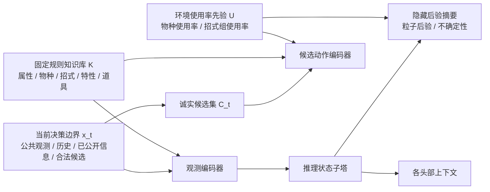
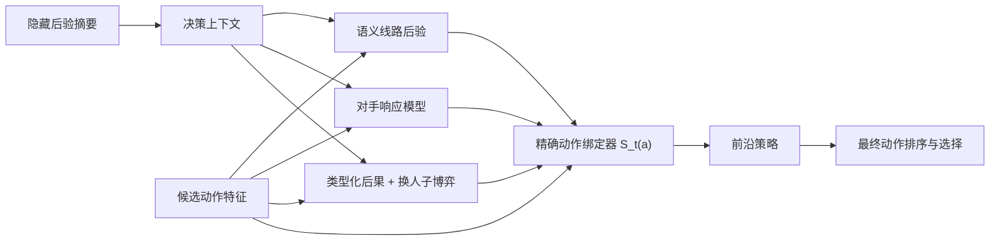
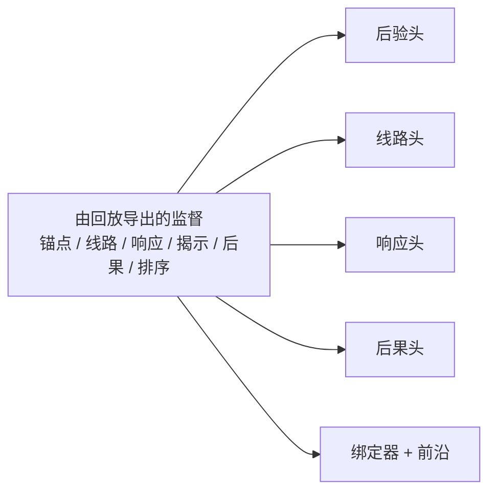

# pokestrategist 数学模型

为照顾没有宝可梦背景、也不熟悉英文术语的读者，下文默认采用“中文主表述，首次出现时保留英文括注”的写法；与代码、数据文件、公式符号直接对应的名称仍保留必要英文。

模型把宝可梦固定规则、环境使用率先验（metagame usage prior）、隐藏配置后验（hidden-set posterior）、语义线路后验（semantic line posterior）、对手响应分布与类型化后果价值（typed consequence value）统一到同一个精确合法动作决策框架中。旧的粗粒度专家线、纯动作家族级重排序器（family-level reranker），以及只依赖可学习物种/招式嵌入（species/move embedding）的设计不再作为主线保留。规则负责合法性与确定性边界，使用率先验负责隐藏候选提案与环境层偏置，神经网络负责隐藏信息建模、语义线路选择、响应闭环和精确动作绑定。


## 0. 对战背景
深度学习课程上，被要求做一个应用深度学习的大作业。突然联想之前游玩网页端宝可梦对战平台 Pokemon Showdown 的经历，意识到宝可梦这个游戏的本质是决策博弈，理论上可以使用深度学习技术完成决策（类似棋类 AI 模型，但由于信息更多、更杂，状态空间也更大，所以更复杂），于是有了以下的模型设计。

游戏示例视频：【【再见Gen9ou】15胜4负！最后上一次1900分！！】 https://www.bilibili.com/video/BV1ofSSBfEqa/?share_source=copy_web&vd_source=996603e4b4a5bf20c0b55f4d68585b91

### 0.1 宝可梦单打在玩什么

本文讨论的不是官方双打 VGC，而是 Smogon 社区主流的 6v6 单打。单打的基本规则可以概括为：

1. 双方各带 6 只宝可梦进入对局，但同一时刻场上各只有 1 只当前在场宝可梦。
2. 每只宝可梦有属性、种族值、特性、道具、4 个招式，以及当前 HP、异常状态和能力等级变化。
3. 每个回合双方同时选择一个动作。动作通常有两大类：
	- 使用当前在场宝可梦的一个招式；
	- 将当前在场宝可梦换下，换上后排另一只宝可梦。
4. 回合结算时，通常由招式优先级和速度决定谁先行动；先后手差异会直接决定谁先造成伤害、谁先强化、谁先换人、谁先击倒对方。
5. 当一只宝可梦 HP 降到 0 时它会倒下（faint），必须由后排补位。先让对方 6 只全部失去战斗能力的一方获胜。

对一个非玩家来说，最重要的认识是：宝可梦单打不是“看到谁克制谁就点一下技能”的静态对题，而是一个资源交换与信息不完全博弈。玩家需要同时管理：

- 血量资源：谁还能安全吃下一次攻击。
- 位置资源：谁在场、谁被迫换人、谁拿到先手压力。
- 场地资源：隐形岩（Stealth Rock）、撒菱（Spikes）、毒菱（Toxic Spikes）、天气、地形、戏法空间（Trick Room）等持续效果。
- 一次性资源：太晶化（Terastallization）、一次性道具、低血量但关键的功能位。
- 隐藏信息：对手未公开的招式、道具、特性、Tera 类型与整队构成。

因此，单打的关键不是只评估“这一回合哪一招伤害最高”，而是评估“这个动作会把对局带到什么新局面”。后文的隐藏后验（hidden posterior）、语义线路（semantic line）、对手响应分布（response distribution）和类型化后果（typed consequence），都是在形式化这个过程。

### 0.2 Gen9 OU 规则是什么

Gen9 OU 可以拆成三部分来理解：

第一，它是第九世代的 6v6 单打环境。也就是说，本文假设使用的是《朱 / 紫》世代的宝可梦、招式、特性、道具与 Terastallization 机制。

第二，OU 是 Smogon 里按使用率划分的层级（usage-based tier）。它不是“只能用 OU 名单上的宝可梦”，而是：

- 被分到 Uber 或被环境直接禁用的内容不能使用；
- 没有被禁用的低分级宝可梦也可以在 OU 使用；
- “OU”这个名字本身来自使用率分层，表示这一环境里最常见的一批宝可梦大约达到 4.52% 的加权使用率阈值。

第三，Gen9 OU 受一组标准条款和禁限表约束。对理解本文最重要的几条是：

- Species Clause：同一队伍不能带两只全国图鉴编号相同的宝可梦，不同形态但同图鉴编号也不行。
- Sleep Moves Clause：不能携带会主动让对手睡眠的招式。
- Evasion 条款：不能通过特定招式或道具人为堆闪避博运气。
- OHKO Clause：不能使用一击必杀招式。
- Moody Clause：队伍里不能有 Moody 特性。
- Endless Battle Clause：不能故意构造无法正常结束的无限对局。

除此之外，Gen9 OU 还会随版本变化维护一份禁限表，禁止过强的宝可梦、特性、道具或招式。对本文来说，最关键的不是记住每一项禁限表细节，而是理解：模型的合法动作空间必须严格服从 Pokemon Showdown 的 `gen9ou` 规则定义，不能输出一个在该环境下根本不允许存在的动作或配置。

对后文最重要的一条具体机制是太晶化（Terastallization）。每名玩家每局最多只能太晶化一次，它会改变宝可梦属性、提升同属性攻击加成，并显著改变对位克制关系。因此，Tera 既是资源问题，也是隐藏信息问题：你不仅要问“对手这回合会不会 Tera”，还要问“如果它 Tera，它最可能变成什么类型、交换什么对位关系”。

另一个关键事实是信息公开边界。Gen9 OU 在对局开始时通常只有队伍预览（team preview）：双方能看到对面的 6 只宝可梦种类（species），但看不到完整招式组（moveset）、道具、特性、努力值、Tera 类型和具体战术分工。也就是说，玩家从第一回合起就处在不完全信息环境中。本文的隐藏配置后验（hidden-set posterior）正是对这部分未知量的形式化。

### 0.3 高手玩家是如何玩一局单打的

高水平玩家的思考流程大致不是“看到当前场面就点一个动作”，而是一个从队伍预览到终盘收束的分阶段流程。

第 1 步是队伍预览规划。对局开始前，高手会先看双方 6 只宝可梦，快速回答几个问题：

- 双方各自最可能的赢法是什么，也就是胜利路径（win condition）在哪里。
- 我方哪几只必须保住，哪些可以被牺牲。
- 对手哪只最可能是撒钉、解钉、速度控制、墙破手、强化手、残局收割手。
- 哪些信息最关键但还未公开，例如对手的道具、速度线、关键补盲招式和 Tera 类型。

第 2 步是建立初始判断（belief）。即便队伍预览只显示宝可梦种类，高手也不会把它当成“完全未知”。相反，他们会立刻结合环境使用率统计形成一个条件先验，例如：某只宝可梦最常见的招式组合是什么、它更像是进攻型还是耐久型、它更可能带什么道具、它的 Tera 更可能是什么方向。这就是后文使用率先验（usage prior）和隐藏后验（hidden posterior）的现实来源。

第 3 步是给当前回合选择一条语义线路，而不是先选一个具体按钮。典型线路包括：

- 信息试探（scout）：优先试探信息，逼对手暴露招式、道具或 Tera。
- 资源保全（preserve）：优先保住关键资源，不让核心被过早削弱。
- 节奏争夺（tempo）：优先拿到主动权，让对手被迫应对。
- 场地压力（hazard）：优先建立或维持场地压力。
- 阻止展开（deny setup）：优先阻止对手强化或展开。
- 胜势转化（convert）：当残局条件成熟时，开始把局面直接转成胜势。

也就是说，高手通常先决定“这一回合我要达成什么战术目标”，再决定“具体是点哪一个招式，还是换到哪一只”。这正对应后文的语义线路后验（semantic line posterior）。

第 4 步是对每个候选动作想象对手的响应。真正决定动作质量的，不是我方动作本身，而是它在对手最可能应对下会导向什么后果。高手会自然地去想：

- 如果我攻击，对手会留场、换人、强化、恢复还是直接 Tera？
- 如果我换人，对手会继续进攻、同时换人、撒钉、强化还是借机抢节奏？
- 这个动作会不会让对手暴露更多信息，或者反过来让我暴露自己的关键资源？

这就是后文对手响应分布（response distribution）的含义。模型不是只需要“预测对手最可能点什么”，而是要把对手响应纳入我方动作价值的主闭环。

第 5 步是按后果而不是按按钮评分。高手最终比较的不是“火系招式 120 威力比 90 威力大”，而是更接近下面这些后果：

- 谁掉了多少血，谁进入了下一拍击杀范围。
- 谁被迫失去 Boots、Leftovers 或 Tera。
- 场上 hazards 是增加了还是被清掉了。
- 速度控制有没有改变，残局谁更快。
- 我是不是逼出了关键 reveal。
- 这个回合是否推进了最终赢法，还是只是做了表面上伤害更高但长期更差的交换。

这正是类型化后果价值（typed consequence value）试图刻画的对象。换句话说，高手玩的不是“动作标签分类”，而是“基于不完全信息和对手响应，对后果做结构化比较”。

第 6 步是阶段性转换。高手会把对局分成早期、中期和残局三个近似阶段：

- 早期更重视队伍预览验证、信息试探、场地压力布局和关键资源保护；
- 中期更重视资源交换、逼出对手应对、为某个胜利路径清路；
- 残局更重视把已经准备好的线路收束成确定胜势，必要时果断交出 Tera 或牺牲一只宝可梦换最终位置。

因此，高手玩家的真实流程可以概括为：

$$
	ext{队伍预览规划}
\rightarrow
	ext{隐藏信息判断更新}
\rightarrow
	ext{语义线路选择}
\rightarrow
	ext{预判对手响应}
\rightarrow
	ext{比较类型化后果}
\rightarrow
	ext{选择精确动作}
$$

后文整套数学模型的设计目标，就是把这条玩家决策流程系统化，而不是把对战简化成一个静态的下一动作分类器。


## 1. 数据获取与处理

这一节解释模型训练时真正看到的数据从哪里来、如何被加工成决策样本，以及哪些处理边界会直接影响后续实验结论。对这类对战决策任务来说，数据问题不是单纯的“抓对战回放然后喂给网络”那么简单；真正重要的是区分原始公共日志、从日志中恢复出的决策边界、训练时额外构造的候选动作，以及独立于回放的固定规则和环境先验。

### 1.1 原始数据来源

当前工程支持两类原始入口，但它们在进入建模前都会被统一为 Pokemon Showdown 对战回放（replay）JSON 格式。

第一类入口是公开 Showdown 对战回放搜索页。`src/pokestrategist/cli/collect_replays.py` 通过 `ReplayClient.search(...)` 按对战格式、分数阈值和页数抓取公开回放，并把原始 JSON 缓存到 `data/raw/replays`。这条路径适合小规模采样、规则修复验证和可追溯的本地缓存构建。

第二类入口是批量回放归档。`src/pokestrategist/cli/download_metamon_subset.py` 可以从 `jakegrigsby/metamon-raw-replays` 这样的公开大规模归档中筛出 `formatid=gen9ou`、`rating >= 1550` 的回放，并输出为本地 JSONL 或逐条缓存文件。当前 v1 主线正式实验主要使用这一类原始输入，例如 `data/raw/metamon_gen9ou_1550_recent10000.jsonl`。

不论来自哪条入口，单条原始回放至少包含以下字段：`id`、`format`、`players`、`log`、`uploadtime` 和 `rating`。其中真正驱动样本构建的是 `log`，因为状态变化、公开信息、换人、伤害、异常状态、场地效果和其他场面效应都要从对战协议日志里按时间顺序恢复。

### 1.2 从对战回放到决策样本

原始回放不会直接送进训练。`src/pokestrategist/cli/build_dataset.py` 调用 `src/pokestrategist/data/dataset_builder.py`，把缓存目录或回放 JSONL 转成 v1 决策模型使用的处理后 JSONL。核心函数 `build_samples_from_replay(...)` 的工作不是做一个“整局分类标签”，而是沿着对战时间线提取一个个真实决策边界。

在这个过程中，builder 会显式恢复并持续更新每一侧的局面状态，包括：

- 当前在场宝可梦种类、HP、异常状态；
- 队伍预览顺序与已倒下名单；
- 已暴露招式、道具、特性、Tera 类型；
- 场地陷阱、屏障、天气、地形、戏法空间等场面信息。

只有真正存在玩家选择的边界才会被保留为监督样本。也就是说，像 `|drag|`、faint 之后的强制补位、以及不对应真实决策的协议事件，不会被当作模型要模仿的 action label。这一点很关键，因为它决定了训练目标是在逼近“玩家的主动决策”，而不是在学习协议里的所有状态转移。

对每个保留下来的决策边界，builder 会写出一个 `DecisionSample`，其中同时包含：

- 当前观测 `observation`；
- 我方动作 `our_action` 与对手实际动作 `opponent_action`；
- 当前可恢复的合法动作集合；
- 语义意图、计划后验、阶段后验、解锁目标等代理监督；
- 判断摘要、资源台账、未来摘要；
- 新版 full-closure 里加入的粒子后验、揭示似然和类型化后果目标。

因此处理后 JSONL 已经不是“原始回放文本的轻度包装”，而是一个围绕决策边界重新组织过的监督数据集。它保留了足够的结构，让后续模型看到真实局面与真实动作之间的关系，同时又把协议级噪声压回到了样本构建阶段。

### 1.3 训练前处理与评估边界

处理后 JSONL 仍然不是训练时的最终输入。`src/pokestrategist/training/dataset.py` 中的 `DecisionTensorDataset` 会在读取样本后进一步完成张量化与候选扩展：它把合法动作编码成结构、身份、先验、元信息和对位特征，并在诚实协议下只对隐藏招式候选做 train-split prior 与 usage prior 的补充提案，而不会把未自然出现的 gold action 重新注入候选集。

训练和验证切分也不是按样本随机打乱，而是通过 `grouped_replay_split(...)` 在回放级别分组切分。这样做的原因是，同一场回放中相邻回合的状态高度相关；如果按样本随机切分，模型很容易在验证集中看到来自同一对局的近邻状态，导致评估过于乐观。与之配套，hidden move prior 也是在 train split 上单独构建，再回填给训练/验证张量化路径，避免直接从全量数据泄漏隐藏招式统计。

这里还要强调一个很实际但常被忽略的处理边界：processed JSONL 不是“一次构建永久有效”的静态制品。只要 `DecisionSample` 的 supervision schema 发生扩展，例如这次 full-closure 加入 `particle_posterior`、`reveal_likelihood` 和 `typed_consequence`，旧版 processed JSONL 就必须重建，否则新增字段会在读取时退化成默认值，形成“代码接线成功但监督全为零”的假阳性。当前正式 full-closure 结果使用的是重建后的 `data/processed/pokestrategist_v1_metamon_gen9ou_1550_recent10000_honestv4_fullclosure_20260510.jsonl`，其意义就在于它保证了新结构确实被训练到了，而不是只存在于模型定义里。

最后，固定规则知识库与 Smogon usage prior 虽然也参与建模，但它们不属于由回放直接导出的监督。本节讨论的数据获取与处理，严格指原始对战日志如何被变成决策样本；固定规则目录和环境先验将在下一节单独说明。


## 2. 问题定义

在第 $t$ 个决策边界，模型不能假设拥有完整真实状态。可用信息是公共观测、我方已知队伍、对手已暴露信息、历史行动以及由训练集归纳出的隐藏信息先验。记观测历史为：

$$
o_{\le t} = (o_0, a^{self}_{<t}, a^{opp}_{<t}, e_{<t})
$$

其中 $e_{<t}$ 是伤害、状态、换人、道具、特性、Tera、天气、场地、hazard 等事件。

目标是在严格合法或诚实候选动作集合上排序：

$$
\hat a_t = \arg\max_{a \in \mathcal C_t} S_\theta(a \mid o_{\le t}, \mathcal K, \mathcal U)
$$

这里 $\mathcal K$ 是固定宝可梦规则知识库，$\mathcal U$ 是外部 metagame usage prior，$\mathcal C_t$ 是当前可比较候选集。当前工程边界下：

$$
\mathcal C_t = \mathcal A_t^{revealed} \cup \mathcal A_t^{switch} \cup \mathcal A_t^{prior-hidden} \cup \mathcal A_t^{abstract-hidden}
$$

并且必须满足 honest 协议：未自然出现的 gold action 不能被注入候选集。

### 2.1 模型架构总览

原先把整套系统画成一张图时，跨模块依赖太多，线条会明显拥挤。这里改成三张分层图：第一张只看输入如何形成状态表征与候选表征，第二张只看决策闭环，第三张只看 replay 监督如何作用到各个头部。后文第 3 到第 8 章就是沿着这三张图依次展开数学定义。



第一张图只回答一个问题：当前回合的公共状态、固定规则和环境先验，是如何被压成后续可用的状态表征与候选动作表征的。



第二张图只保留主干决策路径。为避免重新出现大量交叉线，这里省略了少量辅助依赖，例如某些头部还会额外读取隐藏后验；这些细节以后文正式公式为准。



第三张图强调的是训练边界：我们并不是只用 imitation 去拟合最终动作，而是把隐藏后验、语义线路、对手响应、类型化后果和最终排序一起纳入回放监督，从而让各层中间变量也受到约束。


## 3. 固定规则知识库与环境使用率先验（metagame prior）

这一节回答模型的“确定性常识”和“环境经验”分别来自哪里。宝可梦对战里，有些内容本质上是固定规则事实，例如属性克制、招式威力和道具机制；另一些内容则是环境统计先验，例如某个宝可梦种类在当前环境里最常见的招式组、道具或 Tera。数学上先把这两类信息拆开，目的不是让统计表直接替代决策，而是让模型把学习容量集中在真正不确定、真正需要推断的部分。

宝可梦中存在大量确定信息。它们不应由 replay 数据从零学习，而应以静态 catalog 的形式进入模型：

$$
\mathcal K = (\mathcal T, \mathcal P, \mathcal M, \mathcal B, \mathcal I)
$$

同时引入来自 Smogon 月度统计的外部 usage prior：

$$
\mathcal U = (\mathcal U_{species}, \mathcal U_{moveset})
$$

- $\mathcal T$：18 属性克制矩阵。
- $\mathcal P$：宝可梦 species catalog，包括属性、种族值、可用特性。
- $\mathcal M$：招式 catalog，包括属性、分类、威力、命中、优先级、功能标签。
- $\mathcal B$：特性 catalog，包括免疫、天气、切换触发、伤害修正等标签。
- $\mathcal I$：道具 catalog，包括 Choice 锁招、Boots 防 hazard、Leftovers 回复、Focus Sash 等标签。
- $\mathcal U_{species}$：当月 OU 物种使用率和 rank。
- $\mathcal U_{moveset}$：按 species 条件化的 move、item、ability、tera type 使用率。

规则知识库只负责确定性编码，不直接决定动作排序。也就是说，$\mathcal K$ 产生特征和约束，但最终价值函数仍由数据学习。

当前落地文件位于：

- `data/static/gen9/type_chart.json`
- `data/static/gen9/species.json`
- `data/static/gen9/moves.json`
- `data/static/gen9/abilities.json`
- `data/static/gen9/items.json`
- `data/static/gen9ou/usage.json`
- `data/static/gen9ou/active_subset.json`
- `data/static/gen9ou/observed_usage.json`

代码加载器位于 `src/pokestrategist/data/static_rules.py` 和 `src/pokestrategist/data/usage_priors.py`。type chart 已完整覆盖 18 属性；其他 catalog 由 `pokestrategist-build-static-catalog` 从 Pokemon Showdown 的机器可读固定规则数据构建，并用 Smogon Gen9 OU usage/moveset 统计生成 usage prior。

这里需要区分“全量规则事实”和“候选空间”。全量 catalog 存在磁盘上不会导致模型维度爆炸，因为模型读取的是固定长度的数值特征：species 特征、move 特征和 matchup 特征的维度只由类型数、统计项和标签集合决定，不随 catalog 条目数增长。真正可能拖慢训练和降低信噪比的是候选生成阶段把大量冷门 species/move 当作隐藏候选展开。因此当前策略是：

- 保留全量 `gen9` catalog，避免删除罕见但合法且可能在 replay 中出现的规则事实。
- 额外生成 `data/static/gen9ou/active_subset.json`，用 usage 阈值定义 OU 活跃子集。
- 截断只应用于隐藏候选 prior、moveset prior、候选 proposal 或后续 meta prior，不应用于 revealed legal action、switch legal action 或已观测 replay 事实。
- 本地 processed JSONL 中观测到的 species/move/item/ability 永远加入 active subset，即使 Smogon usage 低于阈值。
- usage prior 不直接覆盖 replay 监督；它只作为 proposal bias 和 candidate prior feature 进入模型。


## 4. 信息状态与隐藏配置后验（Hidden-Set Posterior）

这一节回答模型在每个决策边界“知道什么、不知道什么，以及如何表示不知道”。公共观测只能告诉我们当前已经暴露的局面，但真正影响决策质量的，往往是对手尚未公开的招式、道具、特性、Tera 与整队结构。因此这里不把隐藏信息压成一个模糊的黑盒向量，而是把它明确建模成带不确定性的后验状态，使后续的线路、响应和后果模块都能消费同一套结构化判断。

令当前公共决策状态为：

$$
x_t = (o_{\le t}, \mathcal K, \mathcal U, \mathcal C_t)
$$

模型的内部状态分成观测状态、推理状态、隐藏后验摘要和各头部上下文四层：

$$
\xi_t = (h_t^{obs}, s_t^{plan}, s_t^{belief}, s_t^{resource}, s_t^{phase}, s_t^{unlock}, c_t^{decision}, c_t^{line}, c_t^{route}, c_t^{response}, c_t^{future}, c_t^{branch}, c_t^{support}, c_t^{rule}, m_t, \Sigma_t)
$$

给定我方当前在场宝可梦种类 $p_t^{self}$ 和对手当前在场宝可梦种类 $p_t^{opp}$，先构造固定物种特征：

$$
f_P(p; \mathcal K) = [\text{type-onehot}(p), \text{base-stats}(p), \text{role-summary}(p)]
$$

然后做 observation-level 解耦编码：

$$
o_t^{self} = F_{self}\big(E_P(p_t^{self}) + W_P f_P(p_t^{self};\mathcal K)\big)
$$

$$
o_t^{opp} = F_{opp}\big(E_P(p_t^{opp}) + W_P f_P(p_t^{opp};\mathcal K)\big)
$$

$$
o_t^{hist} = F_{hist}(E_H(o_{<t})), \qquad o_t^{num} = F_{num}(n_t)
$$

$$
h_t^{obs} = F_{obs}\big([o_t^{self}, o_t^{opp}, o_t^{hist}, o_t^{num}]\big)
$$

这里 $n_t$ 是数值局面特征，例如回合数、HP、faint count、Tera 使用、hazard、trick room、revealed move count。

在 observation state 之上，为不同决策对象建立独立的 reason-state 子塔：

$$
s_t^{plan} = F_{plan}(h_t^{obs}), \quad
s_t^{belief} = F_{belief}(h_t^{obs}), \quad
s_t^{resource} = F_{resource}(h_t^{obs}), \quad
s_t^{phase} = F_{phase}(h_t^{obs}), \quad
s_t^{unlock} = F_{unlock}(h_t^{obs})
$$

以及服务于不同头部的上下文子空间：

$$
c_t^{decision} = G_{decision}(s_t^{plan}, s_t^{belief}, s_t^{resource}, s_t^{phase}, s_t^{unlock})
$$

$$
c_t^{line} = G_{line}(s_t^{plan}, s_t^{belief}, s_t^{resource}, s_t^{phase}, s_t^{unlock})
$$

$$
c_t^{route} = G_{route}(s_t^{phase}, s_t^{unlock}), \qquad
c_t^{response} = G_{response}(s_t^{plan}, s_t^{belief}), \qquad
c_t^{future} = G_{future}(s_t^{plan}, s_t^{resource}, s_t^{phase})
$$

$$
c_t^{branch} = G_{branch}(s_t^{plan}, s_t^{phase}), \qquad
c_t^{support} = G_{support}(s_t^{belief}, s_t^{resource}), \qquad
c_t^{rule} = G_{rule}(s_t^{resource})
$$

显式 reason targets 仍然保留，但都来自对应的 reason-state：

$$
\beta_t = \sigma(W_\beta s_t^{belief}), \qquad
\rho_t = W_\rho s_t^{resource}, \qquad
\phi_t = \operatorname{softmax}(W_\phi s_t^{phase}), \qquad
u_t = \sigma(W_u s_t^{unlock})
$$

在这些显式状态之上，隐藏信息不再被压成单个连续 belief summary，而是表示为 hidden configuration：

$$
\eta_t = (T_t^{opp}, M_t^{opp}, I_t^{opp}, A_t^{opp}, \tau_t^{opp,tera}, L_t^{opp}, c_t^{arch})
$$

其中：

- $T_t^{opp}$：对手完整六只队伍及尚未揭示后排；
- $M_t^{opp}$：每只对手宝可梦的完整 moveset；
- $I_t^{opp}$：item assignment；
- $A_t^{opp}$：ability assignment；
- $\tau_t^{opp,tera}$：tera type assignment；
- $L_t^{opp}$：局部锁定状态，例如 Choice lock、Encore、已消耗一次性资源；
- $c_t^{arch}$：team archetype 或战术原型。

于是隐藏空间为：

$$
\mathcal H_t = \{\eta : \mathbf 1_{legal}(\eta;\mathcal K)=1,\ \mathbf 1_{consistent}(\eta;o_{\le t})=1\}
$$

hidden posterior 定义为：

$$
b_t(\eta) = P(\eta \mid x_t), \qquad \eta \in \mathcal H_t
$$

直接枚举 $\mathcal H_t$ 不现实，因此使用粒子近似：

$$
\hat b_t(\eta) = \sum_{i=1}^{N_t} w_t^{(i)} \delta(\eta - \eta_t^{(i)})
$$

$$
w_t^{(i)} \ge 0, \qquad \sum_{i=1}^{N_t} w_t^{(i)} = 1
$$

初始 proposal 分布由合法性、revealed consistency、team prior 和 set prior 共同决定：

$$
q_0(\eta \mid x_t)
\propto
\mathbf 1_{legal}(\eta;\mathcal K)
\mathbf 1_{consistent}(\eta;o_{\le t})
q_{team}(T_t^{opp} \mid o_{\le t}, \mathcal U)
q_{arch}(c_t^{arch} \mid T_t^{opp}, \mathcal U)
\prod_{j=1}^{6}
q_{moves}(M_{t,j}^{opp} \mid p_j, o_{\le t}, \mathcal U)
q_{item}(I_{t,j}^{opp} \mid p_j, o_{\le t}, \mathcal U)
q_{ability}(A_{t,j}^{opp} \mid p_j, o_{\le t}, \mathcal U)
q_{tera}(\tau_{t,j}^{opp,tera} \mid p_j, o_{\le t}, \mathcal U)
$$

这里需要补充一个当前主线尚未单独成模、但非常值得抽出的关键模块：队伍预览隐藏配置先验（team-preview hidden-set prior）。它的目标不是在进入第一个决策边界后才被动地靠局内 reveal 修正未知量，而是在只看到对方 6 只宝可梦种类时，就先把隐藏配置空间大幅压缩。

更具体地说，我们希望在 team preview 时就为对方每一只宝可梦建立一个配置模板变量：

$$
z_j = (M_j, I_j, A_j, \tau_j^{tera}, s_j^{spread}, r_j)
$$

其中：

- $M_j$：该宝可梦的 moveset template；
- $I_j$：item template；
- $A_j$：ability template；
- $\tau_j^{tera}$：Tera type template；
- $s_j^{spread}$：速度线 / 肉度 / 攻击倾向等 spread bucket，而不是一开始就直接回归精确 EV；
- $r_j$：由招式、道具和功能位归纳出的 role tags，例如 hazard、removal、pivot、wallbreak、speed control、wincon。

为避免直接跳到完全黑箱的 joint generator，这里采用两层先验设计。

第一层是单体模板先验：

$$
p_0(z_j \mid p_j)
$$

它只回答“这只 species 在当前 Gen9 OU 环境里最常见的几种配置思路是什么”。这一层以统计模板库为主、轻量学习残差为辅。统计部分来自两类来源：

1. Smogon 月度 moveset / item / ability / tera 使用率；
2. replay hindsight 聚合出的 species-level revealed set template。

这样做的目的，是先把环境中的高频常识稳定地编码出来，而不是让神经网络从零重新发现 Dragapult 常见有 Specs special breaker、Boots hex pivot、Dragon Dance cleaner 等不同思路。

第二层是配队条件重排（team-conditioned reranking）：

$$
q(z_j \mid p_j, T_{-j})
$$

其中 $T_{-j}$ 表示同队其余 5 只宝可梦种类。它回答的问题不再是“这只宝可梦通常怎么带”，而是“这只宝可梦放在这支 6 只队伍里，更可能承担哪种角色与配置”。

一个可实现、也便于解释的 joint score 形式是：

$$
\operatorname{Score}(z_{1:6} \mid T)
=
\sum_{j=1}^{6} \log p_0(z_j \mid p_j)
+
\sum_{j=1}^{6} g_\phi(z_j, T_{-j})
+
\sum_{1 \le i < j \le 6} h_\psi(z_i, z_j)
+
u_\omega(z_{1:6})
$$

其中：

- $\log p_0(z_j \mid p_j)$ 是 species-level 统计先验；
- $g_\phi(z_j, T_{-j})$ 衡量某个模板放进当前配队后的局部合理性；
- $h_\psi(z_i, z_j)$ 衡量两只模板之间的相容或冲突，例如重复职能、速度线冗余、双 removal / 无 removal、双 choice lock 等；
- $u_\omega(z_{1:6})$ 刻画整队层面的角色闭环，例如 hazards、removal、speed control、breaker、pivot、残局 wincon 是否形成基本结构。

这一层不必一开始就做完全联合搜索。工程上可以先采用“species-level template bank + team-conditioned reranker”的近似实现：先由 $p_0$ 给每个 species 提供若干模板候选，再由配队条件对这些候选重排。这样既能利用大量统计信号，也为后续加入 MLP / Transformer / graph reranker 留出接口。

于是，hidden-set posterior 的初始 proposal 可以更精确地写成：

$$
q_0(\eta \mid x_t)
\propto
\mathbf 1_{legal}(\eta;\mathcal K)
\mathbf 1_{consistent}(\eta;o_{\le t})
q_{preview}(z_{1:6} \mid T_t^{opp}, \mathcal U)
q_{lock}(L_t^{opp} \mid z_{1:6}, o_{\le t})
$$

其中 $q_{preview}$ 由上述两层模块给出。把它拆开后，文中的 $q_{team}, q_{arch}, q_{moves}, q_{item}, q_{ability}, q_{tera}$ 不再只是抽象占位符，而是由独立的 team-preview prior 模块实例化：

$$
q_{preview}(z_{1:6} \mid T_t^{opp}, \mathcal U)
=
\operatorname{Rerank}\Big(\prod_{j=1}^{6} p_0(z_j \mid p_j),\ T_t^{opp}\Big)
$$

这里还要强调一个建模边界：spread 不宜在第一版就回归精确 EV。更稳的首版目标是 spread bucket，例如：

- fast offense；
- bulky offense；
- physdef pivot；
- spdef pivot；
- speed-control item line；
- booster / scarf benchmark line；
- unknown / low-evidence。

这样既更贴合 replay 可识别性，也能显著减少弱监督噪声。

对应到当前工程现状，需要明确区分“已经实现的弱版本”与“即将补上的强版本”：

1. 当前主线已经有 species-level usage prior、train-only hidden move prior、candidate prior gated mixture，以及摘要式 particle posterior；
2. 但当前代码还没有一个显式的、独立训练的 team-preview hidden-set prior 模块，能在只看对方 6 只 species 时输出逐只模板后验；
3. 因此，下一阶段最值得单独推进的隐藏信息子模块，就是把这两层 preview prior 真正落地到代码中，并把其输出接回 $q_0(\eta \mid x_t)$ 的初始化路径。

新观测到来后，粒子通过似然重加权：

$$
\widetilde w_t^{(i)} = w_{t-1}^{(i)} \Lambda(o_t \mid x_{t-1}, a_{t-1}^{self}, \eta_{t-1}^{(i)})
$$

$$
w_t^{(i)} = \frac{\widetilde w_t^{(i)}}{\sum_{m=1}^{N_t} \widetilde w_t^{(m)}}
$$

其中观测似然分解为：

$$
\Lambda = \Lambda_{action} \cdot \Lambda_{damage} \cdot \Lambda_{reveal} \cdot \Lambda_{board}
$$

为了让下游网络消费 hidden posterior 而不是完整粒子集合，定义 belief summary 与 uncertainty summary：

$$
m_t = \sum_{i=1}^{N_t} w_t^{(i)} \varphi(\eta_t^{(i)})
$$

$$
\Sigma_t = \sum_{i=1}^{N_t} w_t^{(i)} (\varphi(\eta_t^{(i)}) - m_t)(\varphi(\eta_t^{(i)}) - m_t)^\top
$$

这里 $\varphi(\eta)$ 是对 hidden configuration 的结构化编码，例如未揭示队伍槽位、未揭示 move family、item/ability/Tera 候选分布和 archetype summary 的拼接或图编码。于是 decoupled observation / reason towers 输出的不再只是一个静态向量，而是 semantic line、response model 和 consequence value 共同消费的结构化信息状态。


## 5. 候选动作表示

这一节回答“一个动作在模型里到底是什么”。因为 move、tera-move 和 switch 的语义完全不同，动作表示不能只是一个离散 id；它必须同时包含动作的结构类型、执行主体、规则属性、先验来源、局面元信息以及当前对位关系。把这些因素分块编码的目的，是让模型比较动作时看到的不是一个抽象标签，而是“这个动作为什么在当前局面里可行、危险、常见或罕见”的具体证据。

候选动作 $a$ 分为 move、tera-move、switch 三类：

$$
a = (head(a), move(a), family(a), tera(a), switch(a), source(a))
$$

候选动作编码同时使用 action id、move id、family id、candidate source、prior/support、candidate meta，以及三类规则特征和一组 usage-aware meta prior 特征。

第一，候选 species 特征：

$$
f_P(p_a; \mathcal K)
$$

其中 $p_a$ 对招式动作是当前在场宝可梦种类，对换人动作是换入目标。

第二，候选 move 特征：

$$
f_M(m_a; \mathcal K) = [\text{move-type}, \text{category}, \text{power}, \text{accuracy}, \text{priority}, \text{tags}]
$$

第三，动作对位特征：

$$
f_X(a, o_t; \mathcal K)
$$

当前实现的 $f_X$ 包括：

- 对对手当前在场宝可梦的属性倍率及其 log 编码。
- 是否 STAB。
- 是否免疫、抵抗、克制。
- 招式威力、命中、优先级、是否 status。
- 候选宝可梦与对手当前在场宝可梦的基础速度关系。
- switch 候选面对对手已暴露招式时的最大/平均入场风险。
- species/move 规则是否已知。

第四，外部 usage prior 特征：

$$
f_U(a) = [u^{species}(p_a), u^{move}(p_a,m_a), u^{family}(p_a,g_a), u^{set}(p_a)]
$$

其中：

- $u^{species}$：species 当月使用率的归一化分数；
- $u^{move}$：该 species 下该 move 的条件使用率分数；
- $u^{family}$：该 species 下对应 move family 的聚合使用率分数；
- $u^{set}$：当前已知 item、ability、tera type 与该 species 常见配套程度的平均分数。

因此当前 candidate prior block 为：

$$
f_{prior}(a) = [p^{train}(a), s^{train}(a), f_U(a)]
$$

其中 $p^{train}(a)$ 是 train-only hidden prior 产生的候选概率，$s^{train}(a)$ 是 support 的对数归一化分数。

对于 hidden move proposal，当前实现不是只从训练集先验中取 TopK，而是把 train prior 与 usage prior 合并：

$$
p^{hidden,mix}(m \mid p, R)
=
\operatorname{Normalize}\left(0.6\,p^{train}(m\mid p,R)+0.4\,u^{move}(m\mid p)\right)
$$

其中 $p$ 是当前 species，$R$ 是该 species 已暴露招式集合。对于 abstract hidden family，当前实现使用：

$$
p^{family,mix}(g \mid p)
=
\operatorname{Normalize}\left(0.5\,p^{train}(g\mid p)+0.5\,u^{family}(g\mid p)\right)
$$

早期实现里这两个系数曾采用固定混合比；当前主线代码已经把这一步升级为条件化 gated mixture，用局面相关 gate 在 train prior 与 usage prior 之间自适应插值。

候选动作 latent 由下式生成：

$$
z_t(a) = \operatorname{Fuse}_\theta\big(z_t^{structure}(a), z_t^{identity}(a), z_t^{prior}(a), z_t^{meta}(a), z_t^{matchup}(a)\big)
$$

其中当前实现不再把所有特征先拼成一个大向量再做一次统一编码，而是先解耦成五个子块：

$$
z_t^{structure}(a) = F_{structure}\big(E_{head}, E_{family}, E_{switch}, E_{tera}, E_{recoverable}, E_{source}\big)
$$

$$
z_t^{identity}(a) = F_{identity}\big(E_M(m_a) + W_M f_M(m_a;\mathcal K), E_P(p_a) + W_P f_P(p_a;\mathcal K)\big)
$$

$$
z_t^{prior}(a) = F_{prior}\big(f_{prior}(a)\big)
$$

$$
z_t^{meta}(a) = F_{meta}\big(f_{meta}(a)\big)
$$

$$
z_t^{matchup}(a) = F_{matchup}\big(f_X(a,o_t;\mathcal K)\big)
$$

然后再做受限融合：

$$
z_t(a) = \operatorname{LayerNorm}\left(z_t^{structure}(a) + z_t^{identity}(a) + z_t^{prior}(a) + z_t^{meta}(a) + z_t^{matchup}(a)\right)
$$

这样做的目的是让不同来源的确切特征先在各自子空间里被建模，再进入统一决策层，而不是一开始就在原始特征级别被揉成同一个 joint vector。

这样，模型不再需要从 replay 中重新发现“地面打钢克制”“幽灵免疫一般”“Dragapult 基础速度高于 Gholdengo”这类确定事实。


## 6. 语义线路与类型化后果价值（Semantic Line / Typed Consequence）

这一节从“比较按钮”提升到“比较战术线路和后果”。高手玩家通常不会先在招式层面直接贪心，而是先决定这一回合是在信息试探、资源保全、节奏争夺还是胜势转化，然后再看不同候选动作在这条语义线路下会把局面推进到哪里。对应地，模型先做语义线路的软路由，再把未来影响拆成类型化后果的各个轴，让价值函数比较的是局面演化而不是表面动作名称。

模型不会把决策过程压缩成“对 32 个候选动作直接打一个分数”，而是先在 semantic line 上做 soft routing，再计算 line-conditioned value。定义有限线路集合：

$$
\mathcal L = \{\ell^{\text{scout}}, \ell^{\text{preserve}}, \ell^{\text{tempo}}, \ell^{\text{hazard}}, \ell^{\text{force-tera}}, \ell^{\text{deny-setup}}, \ell^{\text{convert}}, \ell^{\text{sack-pivot}}\}
$$

线路后验定义为：

$$
\pi_t(\ell)
=
P(\ell \mid x_t, \hat b_t)
=
\operatorname{softmax}_{\ell}\Big(W_{\ell}[c_t^{line}, m_t, \operatorname{diag}(\Sigma_t)]\Big)
$$

每条线路携带一组决策参数：

$$
\Theta_{\ell}^{line} = (\omega_{\ell}^{head}, u_{\ell}, \lambda_{\ell}^{risk}, \beta_{\ell}^{info}, \gamma_{\ell}^{switch})
$$

其中：

- $\omega_{\ell}^{head} \in \mathbb R^2$：move / switch head prior；
- $u_{\ell}$：typed consequence utility 权重；
- $\lambda_{\ell}^{risk}$：线路相关尾部风险惩罚；
- $\beta_{\ell}^{info}$：信息增益系数；
- $\gamma_{\ell}^{switch}$：换人子博弈的二拍权重。

candidate / state decoupling 在这里不再只是为若干并列 residual 服务，而是为 line、response 和 consequence 头提供各自的 pair 子空间：

$$
q_t^{rule}(a) = [z_t^{matchup}(a) + z_t^{identity}(a), c_t^{rule}]
$$

$$
q_t^{future}(a) = [z_t^{meta}(a) + z_t^{identity}(a), c_t^{future}]
$$

$$
q_t^{resp}(a) = [z_t^{structure}(a) + z_t^{matchup}(a), c_t^{response}]
$$

固定规则并不直接写死动作，而是通过 $f_M$、$f_X$、$q_t^{rule}$ 和 consequence 约束进入线路价值。

为此，将短期后果表示为 typed consequence lattice，而不是单个抽象 future vector。定义 consequence 空间：

$$
\mathcal Y = \mathcal Y^{hp,self} \times \mathcal Y^{hp,opp} \times \mathcal Y^{ko} \times \mathcal Y^{hazard} \times \mathcal Y^{speed} \times \mathcal Y^{resource} \times \mathcal Y^{info} \times \mathcal Y^{tera} \times \mathcal Y^{position} \times \mathcal Y^{unlock}
$$

其中各轴分别表示血量变化、KO 压力、hazard 变化、速度控制、资源消耗、信息揭示、Tera 交换、位置改善和终盘解锁等 typed consequence。对任意 $(a, r, \eta_t^{(i)})$，模型预测：

$$
y_t(a, r, \eta_t^{(i)}) \in \mathcal Y
$$

线路 $\ell$ 下的 consequence utility 为：

$$
U_{\ell}(y)
=
\sum_{k=1}^{K} u_{\ell,k} \psi_k(y_k)
+
\sum_{1 \le k < m \le K} u_{\ell,km} \psi_{km}(y_k, y_m)
$$

线路相关风险项为：

$$
R_{\ell}(y) = \sum_{k=1}^{K} \rho_{\ell,k} \varphi_k(y_k)
$$

为使 scout、试探换人和 reveal pressure 能进入主价值函数，再定义信息增益：

$$
IG_t(a)
=
H[\hat b_t]
-
\sum_{i=1}^{N_t} w_t^{(i)}
\sum_{r \in \mathcal R_t}
p_\theta(r \mid x_t, \eta_t^{(i)}, a)
H[\hat b_{t+1}^{a,r}]
$$

其中 $H[\hat b_t] = -\sum_i w_t^{(i)} \log w_t^{(i)}$，$\hat b_{t+1}^{a,r}$ 是执行动作 $a$ 并观察响应 $r$ 之后更新的粒子后验。于是 reveal gain、试探价值和 uncertainty reduction 不再是旁路解释项，而是线路效用的一部分。


## 7. 对手响应、换人子博弈与精确动作绑定器（Switch Subgame / Exact Action Binder）

这一节回答“动作价值如何真正闭环到对抗博弈”。单看我方动作本身并不能定义好坏，因为动作的真实价值取决于对手最可能如何响应；而在换人场景里，甚至还取决于换入后一拍是否真的能拿到位置、恢复节奏或逼出新的公开信息。因此这里把对手响应模型、换人的两拍子博弈和最终精确动作绑定器统一起来，让最终分数代表的是响应闭环后的决策质量，而不是脱离博弈的静态打分。

对手响应必须进入主决策闭环。定义响应空间：

$$
\mathcal R_t = \{r^{\text{attack}}, r^{\text{pivot}}, r^{\text{setup}}, r^{\text{status}}, r^{\text{recover}}, r^{\text{switch}}, r^{\text{tera-attack}}, r^{\text{sack}}\}
$$

对于任意粒子 $\eta_t^{(i)}$、线路 $\ell$ 和我方候选动作 $a$，定义：

$$
p_\theta(r \mid x_t, \eta_t^{(i)}, \ell, a)
$$

于是 belief-aggregated 的响应分布为：

$$
\bar p_t(r \mid a, \ell) = \sum_{i=1}^{N_t} w_t^{(i)} p_\theta(r \mid x_t, \eta_t^{(i)}, \ell, a)
$$

线路 $\ell$ 下的 response-closed consequence value 定义为：

$$
Q_t(a \mid \ell)
=
\sum_{i=1}^{N_t} w_t^{(i)}
\sum_{r \in \mathcal R_t}
p_\theta(r \mid x_t, \eta_t^{(i)}, \ell, a)
\Big(U_{\ell}(y_t(a,r,\eta_t^{(i)})) - \lambda_{\ell}^{risk} R_{\ell}(y_t(a,r,\eta_t^{(i)}))\Big)
$$

在 move 候选上，线路价值为：

$$
V_t^{move}(a \mid \ell) = Q_t(a \mid \ell) + \beta_{\ell}^{info} IG_t(a) + \omega_{\ell,move}^{head}
$$

对于 switch 候选，单步 consequence 往往不够，需要显式二拍 subgame。令 $s_j \in \mathcal A_t^{switch}$ 表示换入第 $j$ 个目标，则：

$$
V_t^{switch}(s_j \mid \ell)
=
Q_t^{entry}(s_j \mid \ell)
+
\gamma_{\ell}^{switch} Q_t^{follow}(s_j \mid \ell)
+
\omega_{\ell,switch}^{head}
$$

其中：

- $Q_t^{entry}$：入场当拍的 hazard 税、承伤、位置改善与 reveal gain；
- $Q_t^{follow}$：入场后一拍的恢复、反打、pivot 或迫使对手表态的空间价值；
- $\gamma_{\ell}^{switch}$：线路相关的二拍权重。

于是 unified line-conditioned action value 为：

$$
V_t(a \mid \ell) =
\begin{cases}
V_t^{move}(a \mid \ell), & a \in \mathcal A_t^{move} \\
V_t^{switch}(a \mid \ell), & a \in \mathcal A_t^{switch}
\end{cases}
$$

模型不会在单条线路上硬选择，而是对线路做软混合。最终精确动作绑定器为：

$$
S_t(a) = \log \sum_{\ell \in \mathcal L} \pi_t(\ell) \exp\big(V_t(a \mid \ell)\big)
$$

$$
a_t^{\star} = \arg\max_{a \in \mathcal C_t} S_t(a)
$$

由于 replay 只显示了一个实际动作，但很多局面存在多个合理动作，因此动作选择使用 frontier，而不是假设唯一 gold：

$$
\mathcal F_t = \{a \in \mathcal C_t : S_t(a) \ge \max_{a' \in \mathcal C_t} S_t(a') - \varepsilon_t\}
$$

其中 frontier 宽度由不确定性和 phase 决定：

$$
\varepsilon_t = \varepsilon_0 + \varepsilon_1 H[\hat b_t] + \varepsilon_2 \mathbf 1[\phi_t \in \{\text{scout}, \text{resource}\}]
$$

frontier 内部再定义 soft policy：

$$
\pi_t(a) = \frac{\mathbf 1[a \in \mathcal F_t] \exp(S_t(a)/\tau_t^{policy})}{\sum_{a' \in \mathcal F_t} \mathbf 1[a' \in \mathcal F_t] \exp(S_t(a')/\tau_t^{policy})}
$$

这样可以同时满足三件事：

1. 明显劣动作仍被排除；
2. 多个策略上可接受的动作可以共存；
3. replay one-hot 标签不再被强行解释为“其他一切动作都错”。


## 8. 训练目标

这一节回答“这些结构如何从回放中学出来”。因为回放只展示了一条实际对局路径，而没有显式给出完整隐藏后验、所有合理动作集合或每条线路的真值，所以训练目标不能退化成单一 one-hot 分类。这里的思路是把不同监督拆开处理：让隐藏判断、揭示预测、线路、响应、后果、排序和回放锚点各自承担不同角色，再通过联合目标把它们拼回统一的决策训练图。

训练仍然遵循诚实候选协议（honest candidate protocol）：未自然出现的 gold action 不能被注入候选集，排序只发生在合法候选集与其 frontier 上。

隐藏后验可利用 hindsight reveal 构造后验对齐目标：

$$
\mathcal L_{belief} = D_{KL}(b_t^{post} \parallel \hat b_t)
$$

若完整 hindsight posterior 难以构造，则至少保留 reveal likelihood：

$$
\mathcal L_{reveal} = - \sum_{u>t} \log \sum_i w_t^{(i)} P(\text{reveal}_u \mid \eta_t^{(i)})
$$

semantic line 使用启发式或弱监督标签时，目标为：

$$
\mathcal L_{line} = -\log \pi_t(\ell_t^{proxy})
$$

对手响应使用 belief-aggregated 负对数似然：

$$
\mathcal L_{resp}
=
-\log \sum_i w_t^{(i)} p_\theta(r_t^{obs} \mid x_t, \eta_t^{(i)}, a_t^{replay}, \ell_t)
$$

typed consequence 监督按 consequence 轴逐项进行：

$$
\mathcal L_{cons} = \sum_{k=1}^{K} \mathcal L_k\big(\hat y_{t,k}(a_t^{replay}, r_t^{obs}), y_{t,k}^{obs}\big)
$$

set-valued ranking 不再要求 replay gold 压过所有非 gold，而是只在强证据下构造偏序集合 $\mathcal P_t$：

$$
\mathcal P_t = \{(a_t^{+}, a_t^{-}) : a_t^{+} \succ a_t^{-}\}
$$

$$
\mathcal L_{rank}
=
\frac{1}{|\mathcal P_t|}
\sum_{(a_t^{+}, a_t^{-}) \in \mathcal P_t}
\log\Big(1 + \exp\big(-(S_t(a_t^{+}) - S_t(a_t^{-}))\big)\Big)
$$

为了保持与真实玩家策略分布的对齐，仍保留一个低权重 replay anchor：

$$
\mathcal L_{anchor} = -\log \pi_t(a_t^{replay})
$$

于是总目标为：

$$
\mathcal L
=
\lambda_{belief} \mathcal L_{belief}
+
\lambda_{reveal} \mathcal L_{reveal}
+
\lambda_{line} \mathcal L_{line}
+
\lambda_{resp} \mathcal L_{resp}
+
\lambda_{cons} \mathcal L_{cons}
+
\lambda_{rank} \mathcal L_{rank}
+
\lambda_{anchor} \mathcal L_{anchor}
$$

在分阶段落地时，最先稳定下来的确实是 $\mathcal L_{line} + \mathcal L_{resp} + \mathcal L_{cons} + \mathcal L_{rank} + \mathcal L_{anchor}$。但在最新主线代码中，隐藏后验对齐、frontier 宽度自适应、类型化后果分箱与换人子博弈也已经补进同一训练图中；后续差异主要体现在监督质量、标定和正式长训效果，而不再是“结构尚未接线”。


## 9. 工程落地与实现边界

### 9.1 已完成落地

现阶段代码已经完成以下结构：

- 静态 Gen9 catalog 与 Gen9 OU usage / moveset prior 文件及加载器；
- honest-v4 exact legal-action candidate protocol；
- dataset 动态生成 species、move、matchup rule features 与 external usage prior features；
- hidden candidate proposal 将 train-only hidden prior 与 Smogon usage prior 合并后再提案；
- candidate-side decoupling：structure / identity / prior / meta / matchup 五个候选子塔；
- state-side decoupling：self / opp / history / numeric observation 子塔，以及 decision / line / route / response / future / branch / support / rule 独立 contexts；
- semantic line 监督目标、line posterior 头与 line-conditioned consequence residual；
- candidate-level opponent response supervision 与 response-closed scoring residual；
- particle-posterior 代理头、posterior uncertainty 与 hindsight reveal-likelihood 显式监督；
- typed consequence bins、跨 consequence interaction 项，以及其进入 legal-action score 的 residual；
- switch 的 $Q^{entry} + \gamma Q^{follow}$ 二拍 subgame 与对应训练损失；
- frontier policy、自适应 $\varepsilon_t$ 与 frontier anchor / keep 监督；
- train prior / usage prior 的条件化 gated mixture；
- ability / item rule tags 深入进入 state / belief / response / consequence 路径；
- move / switch 分离的 rule value head；
- 旧 checkpoint 的自动兼容加载与评估。

最近一轮结果：

- `covered_top1 = 0.3549`
- `covered_top3 = 0.6947`
- `switch_target_accuracy = 0.2897`
- `line_accuracy = 0.6214`
- `particle_mae = 0.0711`
- `reveal_bce = 0.2882`
- `typed_consequence_axis_accuracy = 0.7525`
- `ECE = 0.0423`

这说明新增的 particle posterior、reveal-likelihood、typed bins、frontier 和 gated mixture 已经被真正训练到，而不是停留在结构占位或默认零标签上。但与 `lineconsequence_v1` 相比，当前默认权重下核心 ranking、switch target 和 calibration 都出现回落，因此 full-closure 版已经完成第一轮正式验证，却还不能直接替代现有主线。

### 9.2 最新补齐后的剩余工作重心

完整数学模型需要继续打磨的重点，已经不再是“有没有接上”，而是“这些结构是否已经被高质量监督与长程训练充分利用”。当前更现实的继续方向包括：

- 重新平衡 particle / reveal / typed consequence / frontier 等辅助损失与主 ranking / switch 目标的耦合强度，避免辅助结构压低 exact ranking；
- 将当前 particle posterior 代理从启发式 summary 继续提升为更接近非参数 full-particle 的赋值后验；
- 把 hindsight reveal-likelihood 从短窗口显式目标进一步扩展到更长时间尺度与更精细 reveal 事件；
- 对 typed consequence 各轴与 interaction 权重做更严格的标定和正式大规模训练；
- 在 frontier 监督上继续平衡 coverage、top1 precision 与 calibration；
- 检验 item / ability deeper conditioning 在正式大样本训练下是否真正改善 hidden belief 与 response closure。

因此，当前真正的工程瓶颈已经从“结构缺口”转成“监督质量、损失配比、目标冲突与正式训练验证”。这依然不是简单堆大模型就会自动消失的问题，但主框架本身已经具备了这些结构接口。


## 10. 核心原则

这套设计遵循四条约束：

1. 固定规则不从 replay 中重新学习，直接进入特征、合法性检查和后果约束。
2. usage prior 只负责 proposal 与偏置，不能直接凌驾于局面证据之上决定最终动作。
3. 隐藏信息必须以 posterior 的形式进入决策，而不是被提前压成一个不可解释的单向量黑盒。
4. 所有评分都严格发生在 honest legal-action candidate set 内，并通过 frontier 保留多解策略空间。

因此，这份 analysis 描述的不是“硬编码高手经验”，而是“用固定规则减少无谓不确定性，用 hidden posterior、semantic line 与 typed consequence 学习真正不确定的战术判断”。


## 13. 2026-05-30：基于响应条件的后果价值标定（Response-Conditioned Consequence Value Calibration）

### 13.1 动机：为什么 Flat Q(s,a) 不适合当前主线

前序实验已明确证明，直接对所有候选动作学习 `Q(s,a) → 最终输赢`（MC-Q）在当前数据条件下不可行：

- replay 只记录了一个实际执行的动作及其最终对局结果；
- 非 gold 候选动作没有反事实回报，MC-Q 的 pairwise ranking loss 长期保持在 log(2)（随机水平）；
- Q head 通过共享 action encoder 回传梯度会破坏预训练的 backbone。

但这并不意味着 RL/价值学习路线本身错误——问题出在目标是"未分解的全局价值"而不是"由结构化中间表示已经部分解释的局部后果"。

### 13.2 核心设计：从 Q(s,a) 转到 V(consequence(s,a))

当前模型已经产出高质量的结构化中间表示：

- `typed_consequence_values` [B, N, 10]：每个候选动作在 10 个轴上的后果预测（hp_self, hp_opp, ko, hazard, speed, resource, info, tera, position, unlock）；
- `candidate_response_probs`：每个候选动作的对手响应分布；
- `state_future_mean`：局面级别的未来走向摘要，其最后一维 convert_score 可作为当前局面价值代理。

这意味着模型不缺少后果信息，缺少的是把结构化后果翻译成标量价值的最后一层标定。

本节引入 Consequence Value Calibration：

```
V_cons(s, a) = f_theta( typed_consequence(s, a), state_context(s) )
```

其中 f_theta 是一个轻量 MLP（hidden → hidden/4 → 1 → tanh），作为 bounded residual 接入 `legal_action_scores` 主链：

```
S_t(a) = S_t^{supervised}(a) + w_cons * V_cons(s, a)
```

训练目标：V_cons(s, a_gold) 接近 y_t(s)，其中 y_t(s) 是当前局面价值标签。第一版使用 `state_future_mean[:, convert_score]` 作为 proxy；后续可升级为 replay final outcome。

### 13.3 为什么这个设计与原因链不冲突

当前原因链来源于中间头的结构化输出（response_logits、typed_consequence_values、plan/phase/line posteriors），见 `_structured_reason_chain` 实现。

Consequence Value Calibration 只增加一个轻量标量层，不修改任何中间头的结构，不创建新的原因解释头。解释链依然完整地从 `state + candidate → response/consequence/line → chain` 产出，而 V_cons 仅作为后果质量的数值校准 residual。

### 13.4 训练稳定化设计

为避免重蹈 MC-Q 的覆辙：

1. `consequence_value_head` 使用独立的轻量参数，输入是 `typed_consequence_values`（已含有界的后果信息），不直接消费 raw action latents；
2. 默认 `consequence_value_weight = 0.0`，因此新头必须显式开关，不会意外破坏现有模型；
3. V_cons 经 tanh 有界化为 (-1,1)，防止未校准残差支配主分数；
4. 训练时冻结 backbone 或使用极低学习率（backbone lr × 0.1），使价值标定不扭曲已有的精确动作排序；
5. 目标使用 `state_future_mean[:, convert_score]`（已有监督信号），避免依赖真实 final outcome（当前数据缺失）。

### 13.5 可升级路径

- 短期：用 `state_future_mean` 作为 proxy target，在 stage3 基座上做轻量 finetune
- 中期：在 processed dataset 中增加 `final_outcome` 字段（parse replay 的 winner 字段），切换为真实输赢目标
- 长期：V_cons 可进一步扩展为 response-conditioned 版本：
  ```
  V_cons(s,a) = sum_r p(r|s,a) * V( consequence(s,a,r) )
  ```
  其中 p(r|s,a) 来自已有的 `candidate_response_head`

### 13.6 2026-06-01：Consequence Value v2 优化

第一轮全量实验说明，后果价值标定能稳定改善 switch 选择、ECE 和整体 selection score，但 gold 排序基本持平，同时 `false_switch_rate_on_move` 上升。也就是说，V_cons 已经学到“换人后果价值”，但还没有足够区分“应该换”与“只是看起来换人收益高”。

v2 采用四个改动：

1. 高维 latent 后果输入：保留原有 `consequence_value_head(typed_consequence_values, state_context)`，新增并联的 `consequence_value_latent_head(future_action_pair)`。`future_action_pair` 已经是 detach 后的 response/future 子空间表示，不会像早期 MC-Q 那样直接破坏 action backbone；并联方式也能兼容旧 checkpoint。
2. 反事实 margin：除 gold 动作拟合 `state_future_mean[:, convert_score]` 外，加入 hard non-gold 候选约束，使 `V_cons(s,a_gold)` 至少高于 hardest negatives 一个小边际。这个目标不要求真实反事实回报，只要求后果价值层不要把非 gold 的表面好后果排到 gold 之上。
3. 动作类型残差缩放：`V_cons` 接入主分数前按 head 分别缩放，默认保持 1.0；实验时建议 move scale 低于 switch scale，用来压制 false switch side effect。
4. checkpoint averaging：保存 `best_ranking_model` 与 `best_switch_model` 后，可以做 Polyak/线性平均，形成 ranking/switch 之间的折中模型。这一步不改变训练目标，只作为低风险后处理。

补充 guardrail：v2 训练与评估必须同时报告 `consequence_value_margin_mean`、`consequence_value_gold_mean`、`consequence_value_hard_negative_mean`、`false_switch_rate_on_move` 和 ECE。后果价值不是单独追求更高残差，而是在不牺牲 move 局面的前提下修正 switch 与校准。
